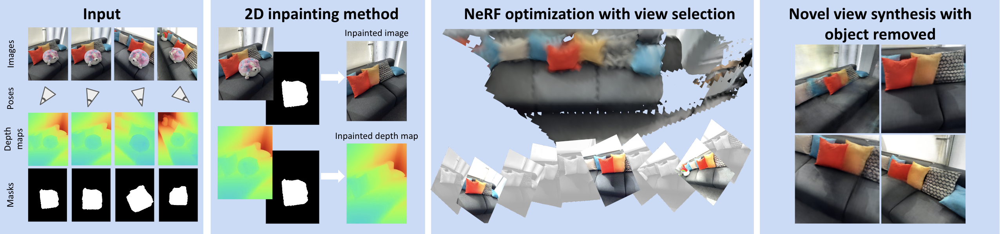

<div align="center">
<h1> Removing Objects from Neural Radiance Fields </h1>
<a href="https://www.silvanweder.com">Silvan Weder</a><sup>1, 2</sup>,
<a href="https://guiggh.github.io">Guillermo Garcia-Hernando</a><sup>2</sup>,
<a href="http://aron.monszp.art">Áron Monszpart</a><sup>2</sup>
<a href="https://people.inf.ethz.ch/marc.pollefeys">Marc Pollefeys</a><sup>2</sup>,
<a href="http://www0.cs.ucl.ac.uk/staff/g.brostow">Gabriel Brostow</a><sup>1, 3</sup>, <br/>
<a href="http://www.michaelfirman.co.uk">Michael Firman</a><sup>1</sup>,
<a href="https://scholar.google.com/citations?user=7wWsNNcAAAAJ">Sara Vicente</a><sup>1</sup> 
  
<sup>1</sup><a href="https://research.nianticlabs.com/">Niantic</a>&nbsp;&nbsp;&nbsp;&nbsp;
<sup>2</sup><a href="https://cvg.ethz.ch/index.php">ETH Zürich</a>&nbsp;&nbsp;&nbsp;&nbsp;
<sup>3</sup><a href="http://www0.cs.ucl.ac.uk/staff/g.brostow/#Research">University College London</a>
  


[[Project Webpage](https://nianticlabs.github.io/nerf-object-removal/)]
[[Paper](https://nianticlabs.github.io/nerf-object-removal/resources/RemovingObjectsFromNeRFs.pdf)]

</div>
<br><br>

This code is for non-commercial use; please see the [license file](LICENSE) for terms.

## Installation

An Nvidia GPU is required to run this code. It's been tested on Ubuntu 20.04.4 LTS.

First, you need to clone this repo:

```shell
git clone --recursive git@github.com:nianticlabs/nerf-object-removal.git
```

In order to install this repository, run the following commands. You might need to adjust the CUDA and cudNN versions in [install.sh](install.sh).
This installation is only tested on CUDA 11.1. With other versions it might not run due to JAX issues.

```shell
conda create -n object-removal python=3.8
conda activate object-removal
# make sure libcudart.so can be found:
export LD_LIBRARY_PATH="${CONDA_PREFIX}/lib:${CONDA_PREFIX}/lib/python3.8/site-packages/nvidia/cuda_runtime/lib/:${LD_LIBRARY_PATH}"
bash ./install.sh
```

## Download Dataset

Please download the data from here using the following command:

```shell
mkdir "$(pwd)/data"
wget -P "$(pwd)/data" "https://storage.googleapis.com/niantic-lon-static/research/nerf-object-removal/nerf-object-removal.zip"
unzip "$(pwd)/data/nerf-object-removal.zip" -d "$(pwd)/data"
```

## Download Big Lama Model from HF

Please download the pretrained Lama model from Hugging Face.

```shell
cd external/lama
wget https://huggingface.co/smartywu/big-lama/resolve/main/big-lama.zip
unzip big-lama.zip
cd ../..
```

## Run End-to-end Optimization

In order to test our pipeline using the default configuration on a scene of the provided dataset, run the following command:

```shell
export SCENE_NUMBER="001"; \
ROOT_DIR="$(pwd)/data/object-removal-custom-clean" \
OUTPUT_DIR="$(pwd)/experiments/real" \
bash ./run_real.sh model/configs/custom/default.gin "${SCENE_NUMBER}"
```

or on the synthetic dataset with

```shell
export SCENE_NUMBER="001"; \
ROOT_DIR="$(pwd)/data/object-removal-custom-clean" \
OUTPUT_DIR="$(pwd)/experiments/synthetic" \
bash ./run_synthetic.sh model/configs/custom_synthetic/default.gin "${SCENE_NUMBER}"
```

You have to adjust the ```$EXPERIMENT_PATH``` and the ```$DATA_PATH``` accordingly in the files above.


## Test a trained model

You can test a trained model using the following command for a real scene

```shell
export SCENE_NUMBER="001"; \
ROOT_DIR="$(pwd)/data/object-removal-custom-clean" \
OUTPUT_DIR="$(pwd)/experiments/real" \
bash ./test_real.sh model/configs/custom/default.gin "${SCENE_NUMBER}"
```

or the following command for a synthetic scene

```shell
export SCENE_NUMBER="001"; \
ROOT_DIR="$(pwd)/data/object-removal-custom-clean" \
OUTPUT_DIR="$(pwd)/experiments/synthetic" \
bash ./test_synthetic.sh model/configs/custom_synthetic/default.gin "${SCENE_NUMBER}"
```


## Visualizing the results

Once the models have been optimized, you can visualize the results using [this notebook](notebooks/vis_experiment.ipynb).

Make sure that you correctly set the ```$EXPERIMENT_DIR``` and the ```$GROUNDTRUTH_DIR``` and follow the notebook carefully to set all required options for your experiment. 

## Evaluating the results

You can evaluate the results using the [evaluation script](evaluation/eval.py).

```shell
python eval.py --experiment "${EXPERIMENT_NAME}" --experiment_root_dir "${EXPERIMENT_DIR}" --benchmark (synthetic/real)
```

## Visualizing the evaluation results

You van visualize the evaluation results using [this notebook](notebooks/vis_results.ipynb).

## Running through Docker

See [docker/README.md](docker/README.md).

## Citation

If you find this work helpful, please consider citing

```
@InProceedings{Weder_2023_CVPR,
    author    = {Weder, Silvan and Garcia-Hernando, Guillermo and Monszpart, \'Aron and Pollefeys, Marc and Brostow, Gabriel J. and Firman, Michael and Vicente, Sara},
    title     = {Removing Objects From Neural Radiance Fields},
    booktitle = {Proceedings of the IEEE/CVF Conference on Computer Vision and Pattern Recognition (CVPR)},
    month     = {June},
    year      = {2023},
    pages     = {16528-16538}
}
```
